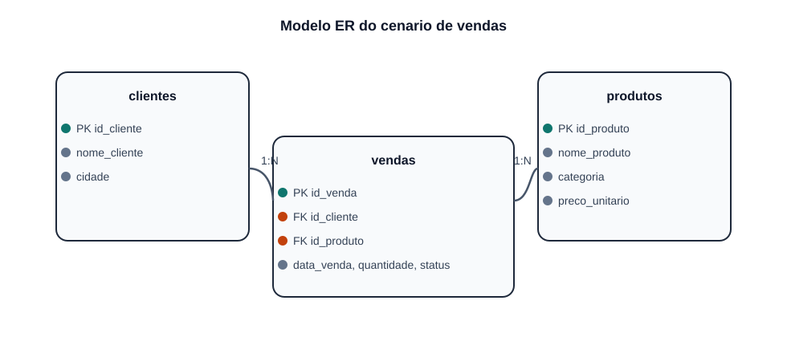

# Contextualizacao do Trabalho

Este projeto foi desenvolvido para demonstrar, em um unico ambiente `PySpark + JupyterLab`, como o `Apache Spark` pode operar com duas tecnologias modernas de tabelas analiticas: `Delta Lake` e `Apache Iceberg`.

O foco do trabalho nao foi apenas executar codigo, mas organizar uma entrega academica completa, com reproducao do ambiente, notebooks, documentacao web e evidencias praticas de `INSERT`, `UPDATE` e `DELETE`.

## Visao geral

| Item | Descricao |
| --- | --- |
| Tema | Apache Spark com Delta Lake e Apache Iceberg |
| Ambiente | Python, UV, PySpark, JupyterLab |
| Fonte de dados | Arquivo `data/vendas.csv` |
| Dominio | Loja varejista |
| Evidencias praticas | `INSERT`, `UPDATE`, `DELETE`, consultas e metadados |
| Entrega documental | `README.md` + `MKDocs` |

## Objetivos do projeto

- criar um ambiente unico e reproduzivel com `PySpark` e `JupyterLab`;
- explicar o papel do `Apache Spark` no processamento de dados;
- demonstrar, de forma pratica, como funcionam tabelas `Delta Lake`;
- demonstrar, de forma pratica, como funcionam tabelas `Apache Iceberg`;
- organizar a entrega em formato adequado para avaliacao tecnica e apresentacao.

## Cenario de negocio

O dominio escolhido foi o de uma loja varejista. A base representa transacoes de venda contendo informacoes de cliente, produto, quantidade, preco unitario e status de pagamento.

Esse cenario foi escolhido porque:

- e simples o suficiente para ser explicado rapidamente;
- possui relacionamento natural entre entidades;
- permite demonstrar comandos de manutencao de dados com clareza;
- facilita a comparacao entre `Delta Lake` e `Apache Iceberg`.

## Fonte de dados utilizada

A fonte foi criada para fins didaticos e esta no arquivo `data/vendas.csv`. Ela contem:

- identificadores de venda, cliente e produto;
- cidade do cliente;
- data da venda;
- quantidade vendida;
- preco unitario do item;
- status de pagamento da transacao.

## Modelo ER

## Entidades derivadas

| Entidade | Papel no modelo |
| --- | --- |
| `clientes` | Armazena os dados cadastrais dos compradores |
| `produtos` | Representa o catalogo de itens vendidos |
| `vendas` | Representa a transacao e relaciona cliente e produto |

## Estrutura dos notebooks

| Notebook | Finalidade |
| --- | --- |
| `01_contexto_modelagem.ipynb` | Apresenta a fonte, o modelo relacional e o DDL |
| `02_delta_lake.ipynb` | Implementa a tabela Delta e demonstra operacoes transacionais |
| `03_apache_iceberg.ipynb` | Implementa a tabela Iceberg e demonstra operacoes com snapshots |

## Como o trabalho foi demonstrado

O fluxo pratico adotado foi:

1. carregar e tipar os dados do arquivo CSV;
2. contextualizar o modelo relacional;
3. criar uma tabela `Delta Lake` e executar `INSERT`, `UPDATE` e `DELETE`;
4. criar uma tabela `Apache Iceberg` e repetir a mesma demonstracao;
5. comparar as evidencias geradas por cada tecnologia.

## Comparacao inicial entre Delta e Iceberg

| Aspecto | Delta Lake | Apache Iceberg |
| --- | --- | --- |
| Integracao com Spark | Muito direta | Muito boa, com foco em catalogo |
| Evidencia principal no projeto | `DESCRIBE HISTORY` | Tabela de metadados `snapshots` |
| Atualizacao e exclusao | Nativas | Nativas |
| Ponto forte destacado | Historico transacional | Metadados e snapshots |

## Resultado esperado

Ao final da execucao, o projeto evidencia que `Delta Lake` e `Apache Iceberg` resolvem problemas semelhantes dentro do ecossistema Spark, mas com diferencas importantes em historico, catalogacao e organizacao de metadados.
